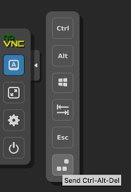

## <u>_[Back](./README.md)_</u>

# Log into windows ( **MUST FOLLOW** )

Note: Do not try Ctrl - Alt - Del command on host computer, follow command below

1. Navigate to the left and expand the arrow
2. Click on the button icon ( A )

Image for reference:  

3. Click on bottom most button ( " Send Ctrl - Alt - Del" ) to open login
4. De-select 
5. Enter password in login box